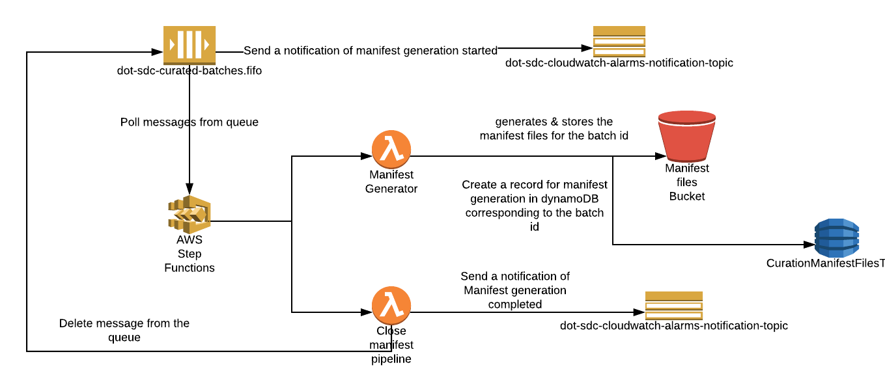

# sdc-dot-waze-poll-for-batches-to-manifest
This lambda function is responsible for polling the batches to start the manifest generation process.

<a name="toc"/>

## Table of Contents

[I. Release Notes](#release-notes)

[II. Overview](#overview)

[III. Design Diagram](#design-diagram)

[IV. Getting Started](#getting-started)

[V. Unit Tests](#unit-tests)

[VI. Support](#support)

---

<a name="release-notes"/>


## [I. Release Notes](ReleaseNotes.md)
TO BE UPDATED

<a name="overview"/>

## II. Overview

There are two primary functions that this lambda function serves:
* **poll_for_batches** - gets the messages from the curated records FIFO queue for a particular batch Id.
* **publish_message_to_sns** - publishes the message to the SNS topic indicating that the manifest generation has started for a particular batch Id.

<a name="design-diagram"/>

## III. Design Diagram



<a name="getting-started"/>

## IV. Getting Started

The following instructions describe the procedure to build and deploy the lambda.

### Prerequisites
* NA 

---
### ThirdParty library

*NA

### Licensed softwares

*NA

### Programming tool versions

*Python 3.6


---
### Build and Deploy the Lambda

#### Environment Variables
Below are the environment variable needed :- 

BATCH_NOTIFICATION_SNS - {arn_of_the_sns_topic_to_send_the_notification}

manifest_sqs  - {name_of_the_sqs_fifo_queue_to_poll_messages_from}

#### Build Process

**Step 1**: Setup virtual environment on your system by foloowing below link
https://docs.aws.amazon.com/lambda/latest/dg/with-s3-example-deployment-pkg.html#with-s3-example-deployment-pkg-python

**Step 2**: Create a script with below contents e.g(sdc-dot-waze-poll-for-batches-to-manifest.sh)
```#!/bin/sh

cd sdc-dot-waze-poll-for-batches-to-manifest
zipFileName="sdc-dot-waze-poll-for-batches-to-manifest.zip"

zip -r9 $zipFileName common/*
zip -r9 $zipFileName lambdas/*
zip -r9 $zipFileName README.md
zip -r9 $zipFileName poll_for_batches_to_process_handler_main.py
zip -r9 $zipFileName root.py
```

**Step 3**: Change the permission of the script file

```
chmod u+x sdc-dot-waze-poll-for-batches-to-manifest.sh
```

**Step 4** Run the script file
./sdc-dot-waze-poll-for-batches-to-manifest.sh

**Step 5**: Upload the sdc-dot-waze-poll-for-batches-to-manifest.zip generated from Step 4 to a lambda function via aws console.

[Back to top](#toc)

---
<a name="unit-tests"/>

## V. Unit Tests

TO BE UPDATED

---
<a name="support"/>

## VI. Support

For any queries you can reach to support@securedatacommons.com
---
[Back to top](#toc)